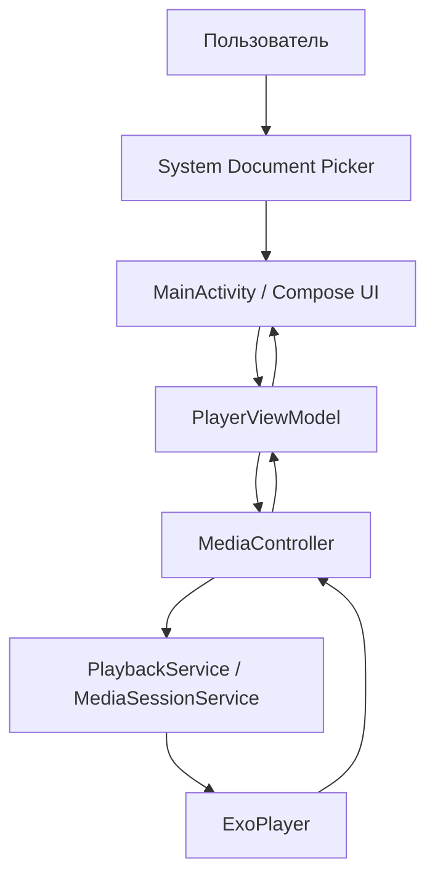

# Техническое задание

## 1. Общие сведения

**Наименование:** Media Player  
**Тип продукта:** мобильное Android-приложение  
**Пакет приложения:** `com.example.mediaplayer`  
**Дата документа:** 9 мая 2026  
**Версия документа:** 1.0

Media Player предназначен для локального воспроизведения аудио- и видеофайлов, выбранных пользователем на устройстве через системный выборщик документов Android.

## 2. Назначение и цели

Цель приложения - предоставить простой медиаплеер для Android, который воспроизводит выбранные пользователем локальные медиафайлы без сканирования всей медиатеки и без передачи данных во внешние сервисы.

Основные задачи:

- обеспечить выбор одного файла или нескольких файлов;
- воспроизводить аудио и видео в одном интерфейсе;
- предоставить базовые элементы управления playback;
- показать пользователю информацию о текущем файле и плейлисте;
- использовать современный Android-стек: Kotlin, Jetpack Compose, AndroidX Media3.

## 3. Целевая аудитория

Приложение рассчитано на пользователей Android-устройств, которым нужен простой локальный плеер для проверки или просмотра отдельных аудио- и видеофайлов, выбранных вручную из файлового хранилища.

## 4. Границы проекта

Входит в текущую версию:

- локальное воспроизведение файлов, выбранных через Storage Access Framework;
- один текущий плейлист из выбранных файлов;
- inline-воспроизведение видео;
- полноэкранный режим для видео;
- базовая информация о текущем файле;
- базовые playback-контролы.

Не входит в текущую версию:

- полноценная медиатека с индексацией устройства;
- сетевое воспроизведение URL/стримов;
- сохранение пользовательских плейлистов;
- shuffle/repeat;
- эквалайзер;
- субтитры;
- расширенное управление уведомлениями;
- авторизация и облачная синхронизация.

## 5. Функциональные требования

| ID | Требование | Реализация в проекте |
| --- | --- | --- |
| F-01 | Пользователь должен иметь возможность выбрать один аудио- или видеофайл. | `OpenDocument` в `MainActivity.kt`, MIME-фильтры `audio/*`, `video/*`. |
| F-02 | Пользователь должен иметь возможность выбрать несколько файлов как плейлист. | `OpenMultipleDocuments` в `MainActivity.kt`. |
| F-03 | Приложение должно получать доступ только к выбранным файлам. | Используется Storage Access Framework и URI выбранных документов. |
| F-04 | Приложение должно пытаться сохранять разрешение на чтение выбранного URI. | `takePersistableUriPermission` в `PlayerViewModel.kt`. |
| F-05 | После выбора файла или плейлиста воспроизведение должно подготавливаться и запускаться. | `setMediaItems`, `prepare`, `play` в `loadPlaylist`. |
| F-06 | Пользователь должен управлять воспроизведением: play, pause, перемотка назад и вперед. | `togglePlayPause`, `seekBack`, `seekForward`. |
| F-07 | Шаг перемотки назад и вперед должен составлять 10 секунд. | `SEEK_STEP_MS = 10_000L` в `PlaybackService.kt`. |
| F-08 | Пользователь должен менять позицию воспроизведения через слайдер. | `SeekBarSection`, `onSeekStart`, `onSeekChange`, `onSeekFinish`. |
| F-09 | Приложение должно показывать текущую позицию и длительность файла. | `formatDuration`, поля `currentPositionMs`, `durationMs`. |
| F-10 | Для видео должен отображаться встроенный видеоплеер. | `AndroidView` с Media3 `PlayerView`. |
| F-11 | Для аудио должен отображаться аудиорежим без видеокартинки. | Проверка `hasVideo`, текст `Аудио`. |
| F-12 | Для видео должен быть доступен полноэкранный режим. | `FullscreenPlayerScreen`, `ApplyFullscreenMode`. |
| F-13 | Пользователь должен видеть список выбранных файлов и переключаться между ними. | `PlaylistCard`, `selectTrack`. |
| F-14 | Пользователь должен видеть имя файла, тип контента, статус, позицию и длительность. | `PlaybackInfoCard`. |
| F-15 | Ошибки воспроизведения должны выводиться на экран. | `onPlayerError` и `errorMessage` в `PlayerUiState`. |

## 6. Нефункциональные требования

| ID | Требование |
| --- | --- |
| NF-01 | Приложение должно поддерживать Android API 24 и выше. |
| NF-02 | Целевая сборка должна использовать Android SDK 36. |
| NF-03 | UI должен быть реализован на Jetpack Compose с Material 3. |
| NF-04 | Воспроизведение должно выполняться через AndroidX Media3 ExoPlayer. |
| NF-05 | UI должен оставаться отзывчивым во время воспроизведения и перемотки. |
| NF-06 | Состояние позиции должно обновляться не реже одного раза в секунду. В текущей реализации интервал составляет 500 мс. |
| NF-07 | Приложение не должно отправлять выбранные файлы во внешние сервисы. |
| NF-08 | Приложение не должно требовать широкого доступа ко всей медиатеке устройства. |
| NF-09 | Интерфейс должен поддерживать светлую и темную тему через Material Theme. |
| NF-10 | Код должен быть разделен на UI, состояние и сервис воспроизведения. |

## 7. Архитектура

Приложение состоит из одного Android-модуля `app`.

Основные компоненты:

- `MainActivity` - точка входа приложения и слой интерфейса. Содержит основной экран, пустое состояние, блок управления, карточку информации, плейлист и полноэкранный режим.
- `PlayerViewModel` - слой состояния и пользовательских действий. Подключается к `PlaybackService` через `SessionToken` и `MediaController`, хранит `PlayerUiState`, управляет плейлистом, перемоткой, выбором трека и fullscreen-флагом.
- `PlaybackService` - Media3 `MediaSessionService`, который создает `ExoPlayer`, задает шаг перемотки и предоставляет `MediaSession`.
- `PlayerUiState` - immutable-модель состояния UI: плейлист, текущий индекс, позиция, длительность, playback-статус, флаги `isPlaying`, `hasVideo`, `isFullscreen`, сообщение об ошибке.

## 8. Данные и хранение

Основная модель данных:

| Модель | Поля | Назначение |
| --- | --- | --- |
| `PlaylistItem` | `uri`, `name` | Описывает выбранный пользователем медиафайл. |
| `PlayerUiState` | playlist, currentIndex, duration, position, flags | Описывает состояние экрана плеера. |

Постоянная база данных в текущей версии отсутствует. Список выбранных файлов хранится в памяти приложения. Для URI выполняется попытка сохранить разрешение на чтение, но сам плейлист не сериализуется в локальное хранилище.

## 9. Пользовательский интерфейс

Основные состояния UI:

- **Пустой экран:** отображается до выбора файлов, содержит кнопки открытия одного файла и плейлиста.
- **Экран плеера:** отображает область воспроизведения, слайдер, кнопки управления, кнопки открытия новых файлов, информацию о текущем файле и плейлист.
- **Полноэкранный экран:** используется для видео, скрывает системные панели, показывает видео на черном фоне, имя файла, слайдер, кнопки управления и кнопку выхода.
- **Состояние ошибки:** выводит текст ошибки воспроизведения на основном экране.

## 10. Разрешения и безопасность

В манифесте объявлены разрешения:

- `android.permission.FOREGROUND_SERVICE`
- `android.permission.FOREGROUND_SERVICE_MEDIA_PLAYBACK`
- `android.permission.POST_NOTIFICATIONS`

Доступ к пользовательским файлам выполняется через Storage Access Framework. Это снижает объем необходимых разрешений: пользователь сам выбирает конкретные документы, а приложение работает с выданными URI.

Требование безопасности: приложение не должно читать файлы вне выданных URI и не должно передавать содержимое файлов по сети без отдельного явного требования.

## 11. Сценарии использования

### UC-01. Воспроизведение одного файла

1. Пользователь запускает приложение.
2. Пользователь нажимает `Открыть файл`.
3. Android показывает системный выборщик документов.
4. Пользователь выбирает аудио- или видеофайл.
5. Приложение загружает файл, запускает воспроизведение и показывает элементы управления.

### UC-02. Воспроизведение плейлиста

1. Пользователь нажимает `Открыть плейлист`.
2. Пользователь выбирает несколько аудио- или видеофайлов.
3. Приложение формирует плейлист в порядке URI, полученных от системного picker.
4. Первый файл начинает воспроизводиться автоматически.
5. Пользователь выбирает другой файл из списка плейлиста.

### UC-03. Полноэкранный просмотр видео

1. Пользователь открывает видеофайл.
2. Приложение определяет наличие видеодорожки.
3. Пользователь нажимает `Во весь экран`.
4. Приложение скрывает системные панели и показывает fullscreen-плеер.
5. Пользователь нажимает `Выйти из полного экрана`.

## 12. Критерии приемки

- Приложение собирается debug-сборкой Gradle без ошибок.
- На Android API 24+ пользователь может выбрать один аудио- или видеофайл.
- Выбранный файл начинает воспроизводиться после выбора.
- Кнопка play/pause меняет состояние воспроизведения.
- Кнопки перемотки меняют позицию на 10 секунд назад или вперед.
- Слайдер позиции позволяет перейти к выбранному моменту файла.
- Для видео отображается картинка в области плеера.
- Для аудио отображается состояние аудиорежима без падения приложения.
- При выборе нескольких файлов отображается плейлист.
- Нажатие на элемент плейлиста переключает текущий файл.
- Для видео доступен вход и выход из полноэкранного режима.
- При ошибке воспроизведения пользователь видит сообщение на экране.

## 13. Тестирование

Текущее состояние тестов:

- `ExampleUnitTest.kt` - шаблонный unit-тест.
- `ExampleInstrumentedTest.kt` - шаблонный instrumented-тест проверки package name.

Рекомендуемые проверки для развития проекта:

- unit-тесты форматирования длительности и переходов состояния;
- тесты ViewModel для открытия плейлиста, выбора трека и seek-сценариев;
- instrumented-тесты базового UI-сценария;
- ручная проверка MP3, AAC, WAV, MP4, MKV, WebM на реальном устройстве и эмуляторе;
- проверка поведения при недоступном URI или неподдерживаемом формате.

## 14. Риски и ограничения

- Поддержка конкретных кодеков зависит от ExoPlayer и возможностей устройства.
- Runtime-запрос `POST_NOTIFICATIONS` не реализован, хотя разрешение объявлено в манифесте.
- Состояние плейлиста не восстанавливается после завершения процесса приложения.
- Нет отдельной обработки аудиофокуса, noisy intent и внешних устройств управления в UI.
- Тестовое покрытие функциональности плеера отсутствует.

## 15. Возможное развитие

- Добавить сохранение последнего плейлиста и позиции воспроизведения.
- Добавить shuffle и repeat.
- Добавить экран настроек.
- Добавить поддержку субтитров для видео.
- Добавить отображение metadata и обложек для аудио.
- Добавить runtime-запрос уведомлений для Android 13+.
- Добавить notification playback controls и lock screen controls.
- Расширить тестовое покрытие ViewModel и UI.
